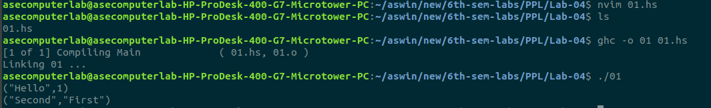

# 20CYS312 - Principles of Programing Languages - Lab Exercise 4

---

## Roll number: CH.EN.U4CYS22002

## Name: S. ASWIN SREE RAM

---

### Ex01. Define a function `swapTuple :: (a, b) -> (b, a)` that swaps the elements of a tuple.

**Objective of the Exercise:**

The goal is to understand and implement the concept of tuple manipulation in Haskell by swapping the elements of a tuple.

**Program Code:**

```haskell
swapTuple :: (a, b) -> (b, a)
swapTuple (x, y) = (y, x)

main :: IO ()
main = do
  print (swapTuple (1, "Hello"))
  print (swapTuple ("First", "Second"))

```

**Explanation of the Code:**

The `swapTuple` function takes a tuple `(a, b)` as input. Using pattern matching, it extracts the elements `x` and `y` and returns a new tuple `(y, x)` where the elements are swapped. The `main` function demonstrates the usage of `swapTuple` with two example tuples.

**Input/Output Examples:**

Input:

```haskell
swapTuple (1, "Hello")
swapTuple ("First", "Second")

```

Output:

```
("Hello", 1)
("Second", "First")

```

**Screenshots:**



**Conclusion:**

This exercise reinforced understanding of tuple manipulation and pattern matching in Haskell, showcasing how to work with and rearrange data in tuples.

### Ex02. Define a function `multiplyElements :: Num a => [a] -> a -> [a]` that multiplies each element in a list by a given multiplier.

**Objective of the Exercise:**

The goal is to understand and implement the concept of list comprehensions in Haskell by multiplying each element of a list by a given multiplier.

**Program Code:**

```haskell
multiplyElements :: Num a => [a] -> a -> [a]
multiplyElements xs n = [x * n | x <- xs]

main :: IO ()
main = do
  print (multiplyElements [1, 2, 3, 4] 2)
  print (multiplyElements [5, 10, 15] 3)

```

**Explanation of the Code:**

The `multiplyElements` function takes a list `xs` and a multiplier `n` as input. It uses a list comprehension to iterate through each element `x` in the list `xs` and multiplies it by `n`. The result is a new list where every element is scaled by the multiplier. The `main` function demonstrates the usage with two examples.

**Input/Output Examples:**

Input:

```haskell
multiplyElements [1, 2, 3, 4] 2
multiplyElements [5, 10, 15] 3

```

Output:

```
[2, 4, 6, 8]
[15, 30, 45]

```

**Screenshots:**


**Conclusion:**

This exercise reinforced understanding of list comprehensions in Haskell, demonstrating their power to apply transformations to lists in a concise and readable manner.

### Ex03. Define a function `filterEven :: [Int] -> [Int]` that filters out all even numbers from a list of integers.

**Objective of the Exercise:**

The goal is to understand and implement the use of higher-order functions in Haskell by filtering a list of integers to exclude even numbers.

**Program Code:**

```haskell
filterEven :: [Int] -> [Int]
filterEven = filter odd

main :: IO ()
main = do
  print (filterEven [1, 2, 3, 4, 5, 6])
  print (filterEven [10, 15, 20, 25])

```

**Explanation of the Code:**

The `filterEven` function uses the `filter` function, a higher-order function that applies a predicate (condition) to each element of a list. Here, the predicate `odd` is used to keep only the odd numbers in the list, effectively removing all even numbers. The `main` function demonstrates the usage of `filterEven` with two example lists.

**Input/Output Examples:**

Input:

```haskell
filterEven [1, 2, 3, 4, 5, 6]
filterEven [10, 15, 20, 25]

```

Output:

```
[1, 3, 5]
[15, 25]

```

**Screenshots:**


**Conclusion:**

This exercise reinforced understanding of higher-order functions in Haskell, showcasing how to use `filter` to process lists efficiently and apply conditions to their elements.

### Ex04. Define a function `listZipWith :: (a -> b -> c) -> [a] -> [b] -> [c]` that applies a function to corresponding elements from two lists.

**Objective of the Exercise:**

The goal is to understand and implement the concept of combining two lists by applying a function to their corresponding elements, mimicking the behavior of `zipWith` in Haskell.

**Program Code:**

```haskell
listZipWith :: (a -> b -> c) -> [a] -> [b] -> [c]
listZipWith _ [] _ = []
listZipWith _ _ [] = []
listZipWith f (x:xs) (y:ys) = f x y : listZipWith f xs ys

main :: IO ()
main = do
  print (listZipWith (+) [1, 2, 3] [4, 5, 6])
  print (listZipWith (*) [1, 2, 3] [4, 5, 6])
  print (listZipWith (\\x y -> (x, y)) [1, 2] ["a", "b", "c"])

```

**Explanation of the Code:**

The `listZipWith` function takes three arguments: a binary function `f`, and two lists. It recursively applies the function `f` to the heads of the two lists and combines the results into a new list. The recursion stops when either of the input lists is empty. The `main` function demonstrates the usage with examples of addition, multiplication, and pairing.

**Input/Output Examples:**

Input:

```haskell
listZipWith (+) [1, 2, 3] [4, 5, 6]
listZipWith (*) [1, 2, 3] [4, 5, 6]
listZipWith (\\x y -> (x, y)) [1, 2] ["a", "b", "c"]

```

Output:

```
[5, 7, 9]
[4, 10, 18]
[(1,"a"), (2,"b")]

```

**Screenshots:**


**Conclusion:**

This exercise reinforced understanding of recursive list processing in Haskell, demonstrating how to create custom list-processing functions by combining elements from two lists using a user-defined function.

### Ex05. Define a function `reverseList :: [a] -> [a]` that reverses a list using recursion.

**Objective of the Exercise:**

The goal is to understand and implement recursion in Haskell to reverse the order of elements in a list.

**Program Code:**

```haskell
reverseList :: [a] -> [a]
reverseList [] = []
reverseList (x:xs) = reverseList xs ++ [x]

main :: IO ()
main = do
  print (reverseList [1, 2, 3] :: [Int])  -- specify the type as [Int]
  print (reverseList ["a", "b", "c"] :: [String])  -- specify the type as [String]
  print (reverseList [] :: [Int])  -- specify the type as [Int]
```

**Explanation of the Code:**

The `reverseList` function works recursively:

- **Base Case:** If the input list is empty (`[]`), the result is an empty list.
- **Recursive Case:** If the input list is `(x:xs)`, the function reverses the tail (`xs`) and appends the head (`x`) to the end of the reversed list using the `++` operator.

The `main` function demonstrates the usage of `reverseList` with examples including integers, strings, and an empty list.

**Input/Output Examples:**

Input:

```haskell
reverseList [1, 2, 3]
reverseList ["a", "b", "c"]
reverseList []

```

Output:

```
[3, 2, 1]
["c", "b", "a"]
[]

```

**Screenshots:**


**Conclusion:**

This exercise reinforced understanding of recursion and list operations in Haskell, showcasing how to process lists in a step-by-step manner to achieve a desired result, such as reversing the elements.

### Ex06. Define a function `averageMarks :: [Int] -> Float` that calculates the average marks of a student.

**Objective of the Exercise:**

The goal is to implement a function that calculates the average marks of a student from a list of their marks. This exercise helps in understanding recursion, type definitions, and processing lists in Haskell.

**Program Code:**

```haskell

type Student = (String, Int, [Int])

averageMarks :: [Int] -> Float
averageMarks [] = 0 
averageMarks marks = fromIntegral (sum marks) / fromIntegral (length marks)

displayStudentAverages :: [Student] -> IO ()
displayStudentAverages [] = return () 
displayStudentAverages ((name, _, marks):xs) = do
    let avg = averageMarks marks
    putStrLn (name ++ "'s average marks: " ++ show avg)
    displayStudentAverages xs 

main :: IO ()
main = do
    let students = [ ("John", 1, [85, 90, 78, 92])
                   , ("Jane", 2, [88, 76, 91, 85])
                   , ("Tom", 3, [79, 82, 88, 85])
                   ]
    displayStudentAverages students  

```

**Explanation of the Code:**

The code is designed to manage student records and calculate their average marks. It contains:

- **`Student` type**: A tuple `(String, Int, [Int])`, where:
    - `String`: The student's name.
    - `Int`: The student's roll number.
    - `[Int]`: A list of marks.
- **`averageMarks` function**: A recursive function that calculates the average of a list of integers (marks).
    - If the list is empty, it returns 0.
    - Otherwise, it sums the marks and divides the sum by the length of the list to find the average.
- **`displayStudentAverages` function**: This recursively iterates over a list of students and prints each student's name and average marks.
- **`main` function**: A list of students is created, and `displayStudentAverages` is called to print the names and average marks.

**Input/Output Examples:**

Input:

```haskell
displayStudentAverages [("John", 1, [85, 90, 78, 92]),
                        ("Jane", 2, [88, 76, 91, 85]),
                        ("Tom", 3, [79, 82, 88, 85])]

```

Output:

```
John's average marks: 86.25
Jane's average marks: 85.0
Tom's average marks: 83.5

```

**Screenshots:**


**Conclusion:**

This exercise demonstrates the use of recursion in Haskell for both calculating averages and processing lists. It also introduces the concept of defining types for complex data structures like student records and implementing functions to manipulate them.

---