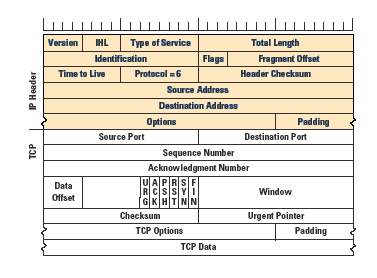

## Google Docking Cheet Sheet
| Filter          | Description                                        | Example                              |
| :-------------- |:---------------------------------------------------| :------------------------------------|
| allintext      | Searches for occurrences of all the keywords given. | `allintext:"keyword"` |
| intext      | Searches for the occurrences of keywords all at once or one at a time. | `intext:"keyword"` |
| inurl      | Searches for a URL matching one of the keywords. | `inurl:"keyword"` |
| allinurl      | Searches for a URL matching all the keywords in the query. | `allinurl:"keyword"` |
| intitle      | Searches for occurrences of keywords in title all or one. | `intitle:"keyword"` |
| allintitle      | Searches for occurrences of keywords all at a time. | `allintitle:"keyword"` |
| site      | Specifically searches that particular site and lists all the results for that site. | `site:"www.google.com"` |
| filetype      | Searches for a particular filetype mentioned in the query. | `filetype:"pdf"` |
| link      | Searches for external links to pages. | `link:"keyword"` |
| numrange      | Used to locate specific numbers in your searches. | `numrange:321-325` |
| before/after      | Used to search within a particular date range. | `filetype:pdf & (before:2000-01-01 after:2001-01-01)` |
| allinanchor (and also inanchor)      | This shows sites which have the keyterms in links pointing to them, in order of the most links. | `inanchor:rat` |
| allinpostauthor (and also inpostauthor)      | Exclusive to blog search, this one picks out blog posts that are written by specific individuals. | `allinpostauthor:"keyword"` |
| related      | List web pages that are “similar” to a specified web page. | `related:www.google.com` |
| cache      | Shows the version of the web page that Google has in its cache. | `cache:www.google.com` |

# This is the main website 
[Google Docking Link ](https://www.exploit-db.com/google-hacking-database)

## Difference between Physical logical and port 
Here's a simple table to summarize the differences between **Physical Address (MAC Address)**, **Logical Address (IP Address)**, and **Socket/Port**:

| **Aspect**              | **Physical Address (MAC Address)**                   | **Logical Address (IP Address)**                    | **Socket/Port**                                      |
|-------------------------|------------------------------------------------------|-----------------------------------------------------|------------------------------------------------------|
| **Purpose**             | Identifies a device on the local network            | Identifies a device on the internet or different networks | Identifies a specific service/application on a device |
| **Type of Address**     | Hardware address                                    | Network address                                     | Endpoint for application communication               |
| **Layer**               | Data Link Layer (Layer 2)                           | Network Layer (Layer 3)                             | Transport Layer (Layer 4)                            |
| **Format**              | 48-bit address (e.g., `00:1A:2B:3C:4D:5E`)           | 32-bit (IPv4) or 128-bit (IPv6) address (e.g., `192.168.1.1`) | 16-bit number (e.g., port 80 for HTTP)               |
| **Scope**               | Local network only (LAN)                            | Routable across the internet or different networks  | Identifies service on a specific device              |
| **Assigned by**         | Manufacturer (burned into hardware)                 | Internet authority (e.g., ISP or network admin)     | Operating system (for each application/service)      |
| **Example**             | `00:1A:2B:3C:4D:5E`                                | `192.168.1.1` (IPv4) or `2001:0db8:85a3::8a2e:0370:7334` (IPv6) | IP `192.168.1.1` with port `80` for HTTP             |

This table simplifies the comparison between these three types of addresses and their roles in networking.

## TCP Packet Header 
