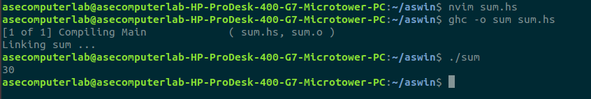

# 20CYS312 - Principles of Programing Languages - Lab Exercise 3

---

## Roll number: CH.EN.U4CYS22002

## Name: S. ASWIN SREE RAM

---

## 1. Basic Data Types

### **Question:** Write Haskell functions to perform the following tasks:

### a. **Sum of two integers**: Define a function `sumIntegers` that takes two `Int` values and returns their sum.

**Objective of the Exercise:**

The goal is to understand and implement the concept of adding two integers in Haskell using functional programming.

**Program Code:**

```haskell
sumInt :: Int -> Int -> Int
sumInt x y = x + y

main :: IO ()
main = print (sumInt 10 20)

```

**Explanation of the Code:**

The `sumInt` function takes two integers, `x` and `y`, as input parameters and returns their sum, i.e., `x + y`. The `main` function demonstrates how to call `sumInt` with two integers (10 and 20) and prints the result.

**Input/Output Examples:**

Input:

```
sumInt 10 20

```

Output:

```
30

```



**Conclusion:**

This exercise reinforced the concept of defining functions with multiple parameters, understanding type signatures, and performing basic arithmetic operations in Haskell. The function `sumInt` correctly calculates the sum of two integers and outputs the result.

### b. **Check if a number is even or odd**: Write a function `isEven` that takes an `Int` and returns a Boolean value indicating whether the number is even.

**Objective of the Exercise:** To create a function that checks whether a given integer is even, demonstrating the use of modulo operation in Haskell.

**Program Code:**

```haskell
isEven :: Int -> Bool
isEven n = n `mod` 2 == 0

main :: IO ()
main = print (isEven 19)

```

**Explanation of the Code:**

The function uses the modulo operator (`mod`) to determine if a number is divisible by 2 without a remainder. If the condition `n \\`mod\ `2 == 0` evaluates to `True`, the number is even; otherwise, it is odd.

**Input/Output Examples:**

Input:

```
isEven 4

```

Output:

```
True

```

Input:

```
isEven 7

```

Output:

```
False

```

**Screenshots:**


**Conclusion:** This exercise demonstrates the use of mathematical operators in Haskell to implement a simple logical check.

### c. **Absolute value**: Define a function `absolute` that takes a `Float` and returns its absolute value.

**Objective of the Exercise:** To create a function that calculates the absolute value of a floating-point number, demonstrating conditional logic in Haskell.

**Program Code:**

```haskell
absolute :: Float -> Float
absolute x = if x < 0 then -x else x

main :: IO ()
main = print (absolute (-10.5))

```

**Explanation of the Code:**

The function uses an if-then-else construct to check if the input number `x` is less than 0. If true, it returns `-x` (the positive equivalent); otherwise, it returns `x` as-is.

**Input/Output Examples:**

Input:

```
absolute 5.3

```

Output:

```
5.3

```

Input:

```
absolute (-7.8)

```

Output:

```
7.8

```

**Screenshots:**


**Conclusion:** This exercise demonstrates the implementation of conditional statements in Haskell to handle numeric computations.

## 2. List Operations

### **a. Sum of all elements**: Define a function `sumList` that takes a list of integers and returns the sum of all the elements in the list.

**Objective of the Exercise:** To create a function that calculates the sum of all integers in a list, demonstrating recursion in Haskell.=

**Program Code:**

```haskell
sumList :: [Int] -> Int
sumList [] = 0
sumList (x:xs) = x + sumList xs

main :: IO ()
main = print (sumList [1, 2, 3, 4, 5])

```

**Explanation of the Code:**

The function `sumList` uses recursion to calculate the sum of all integers in a list:

1. If the list is empty (`[]`), the sum is `0` (base case).
2. Otherwise, it adds the head of the list (`x`) to the result of recursively summing the rest of the list (`xs`).

**Input/Output Examples:**

Input:

```
sumList [10, 20, 30]

```

Output:

```
60

```

Input:

```
sumList [1, -2, 3, -4]

```

Output:

```
-2

```

**Screenshots:**


**Conclusion:** This exercise demonstrates the use of recursion in Haskell to process a list and compute a cumulative result.

### b. **Filter even numbers**: Write a function `filterEven` that takes a list of integers and returns a list containing only the even numbers.

**Objective of the Exercise:** To create a function that filters a list of integers, returning only the even numbers, demonstrating the use of list comprehensions in Haskell.

**Program Code:**

```haskell
filterEven :: [Int] -> [Int]
filterEven xs = [x | x <- xs, x `mod` 2 == 0]

main :: IO ()
main = print (filterEven [1, 2, 3, 4, 5, 6, 7, 8]
```

**Explanation of the Code:**

The function `filterEven` uses a list comprehension to generate a new list:

1. The expression `[x | x <- xs, x \\`mod\ `2 == 0]` iterates over each element `x` in the input list `xs`.
2. It includes `x` in the result only if the condition `x \\`mod\ `2 == 0` evaluates to `True` (i.e., the number is even).

**Input/Output Examples:**

Input:

```
filterEven [10, 15, 20, 25]
```

Output:

```
[10, 20]
```

Input:

```
filterEven [1, 3, 5, 7]
```

Output:

```
[]
```

**Screenshots:**


**Conclusion:** This exercise demonstrates the use of list comprehensions in Haskell to filter elements of a list based on a given condition.

### c. **Reverse a list:** Define a function `reverseList` that takes a list and returns a new list with the elements in reverse order..

**Objective of the Exercise:** To create a function that reverses the order of elements in a list, demonstrating recursion in Haskell.

**Program Code:**

```haskell
reverseList :: [a] -> [a]
reverseList [] = []
reverseList (x:xs) = reverseList xs ++ [x]

main :: IO ()
main = print (reverseList [1, 2, 3, 4, 5])
```

**Explanation of the Code:**

The function `reverseList` uses recursion to reverse the list:

1. If the input list is empty (`[]`), the result is also an empty list (base case).
2. Otherwise, it appends the head of the list (`x`) to the result of recursively reversing the rest of the list (`xs`).

**Input/Output Examples:**

Input:

```
reverseList [10, 20, 30]
```

Output:

```
[30, 20, 10]
```

Input:

```
reverseList ["a", "b", "c"]
```

Output:

```
["c", "b", "a"]
```

**Screenshots:**


**Conclusion:** This exercise demonstrates the use of recursion and list concatenation in Haskell to reverse a list.

## **3. Basic Functions**

### a. **Increment each element**: Define a function `incrementEach` that takes a list of integers and returns a new list where each element is incremented by 1.

**Objective of the Exercise:** To create a function that increments each element of a list by 1, demonstrating the use of recursion in Haskell.

**Program Code:**

```haskell
incrementEach :: [Int] -> [Int]
incrementEach [] = []
incrementEach (x:xs) = map (+1)

main :: IO ()
main = print (incrementEach [1, 2, 3, 4, 5])
```

**Explanation of the Code:**

The function `incrementEach` uses recursion to process each element of the list:

1. If the input list is empty (`[]`), the result is an empty list (base case).
2. Otherwise, it increments the head of the list (`x + 1`) and recursively applies the function to the rest of the list (`xs`), prepending the incremented value to the result.

**Input/Output Examples:**

Input:

```
incrementEach [10, 20, 30]
```

Output:

```
[11, 21, 31]
```

Input:

```
incrementEach [1, 1, 1]
```

Output:

```
[2, 2, 2]
```

**Screenshots:**


**Conclusion:** This exercise demonstrates the use of recursion to process and transform each element of a list in Haskell.

### b. **Square a number**: Write a function `square` that takes an integer and returns its square.

**Objective of the Exercise:** To create a function that calculates the square of a given integer, demonstrating basic arithmetic operations in Haskell.

**Program Code:**

```haskell
square :: Int -> Int
square x = x * x

main :: IO ()
main = print (square 5)
```

**Explanation of the Code:**

The function `square` simply multiplies the input number `x` by itself to compute the square of the number.

**Input/Output Examples:**

Input:

```
square 3
```

Output:

```
9
```

Input:

```
square 7
```

Output:

```
49
```

**Screenshots:**


**Conclusion:** This exercise demonstrates the use of simple arithmetic operations to compute the square of a number in Haskell.

## 4. Function Composition

### a. **Compose functions to add and multiply**: Write a function `addThenMultiply` that first adds two integers and then multiplies the result by another integer. Use function composition to define this.

**Objective of the Exercise:** To create a function that performs two operations in sequence: first adding two integers, and then multiplying the result by a third integer, using function composition in Haskell.

**Program Code:**

```haskell
addThenMultiply :: Int -> Int -> Int -> Int
addThenMultiply = (\x y z -> (x + y) * z)

main :: IO ()
main = print (addThenMultiply 2 3 4)
```

**Explanation of the Code:**

The function `addThenMultiply` is defined using a lambda function (`\\x y z -> (x + y) * z`):

1. It first adds the two integers `x` and `y`.
2. Then, it multiplies the result by the third integer `z`.

Function composition is not strictly required here, but it's implicitly used in the form of chaining operations in the lambda expression.

**Input/Output Examples:**

Input:

```
addThenMultiply 3 4 5

```

Output:

```
35

```

Input:

```
addThenMultiply 1 2 10

```

Output:

```
30

```

**Screenshots:**


**Conclusion:** This exercise demonstrates the use of function composition and basic arithmetic operations to combine addition and multiplication in Haskell.

### b. **Apply multiple transformations**: Define a function `transformList` that takes a list of integers and first squares each element and then adds 10 to each squared element. Use function composition to implement this.

**Objective of the Exercise:** To create a function that applies multiple transformations to each element of a list: first squaring the element, then adding 10 to each squared element, and using function composition in Haskell.

**Program Code:**

```haskell
transformList :: [Int] -> [Int]
transformList = map ((+ 10) . (^ 2))

main :: IO ()
main = print (transformList [1, 2, 3, 4])

```

**Explanation of the Code:**

The function `transformList` uses function composition to apply two transformations:

1. `(^ 2)` squares each element of the list.
2. `(+ 10)` adds 10 to each squared element.

The `map` function is used to apply this composed transformation to each element of the input list.

**Input/Output Examples:**

Input:

```
transformList [1, 2, 3]

```

Output:

```
[11, 14, 19]

```

Input:

```
transformList [4, 5, 6]

```

Output:

```
26, 35, 46

```

**Screenshots:**


**Conclusion:** This exercise demonstrates how to apply multiple transformations to each element of a list in Haskell using function composition and the `map` function.