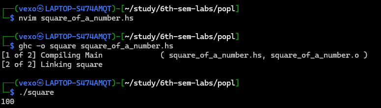

# Lab-02-report

---

## Roll number: CH.EN.U4CYS22002

## Name: S. ASWIN SREE RAM

---

## 1. Functions and Types

### Ex01. Define a function square :: Int -> Int that takes an integer and returns its square.

**Objective of the Exercise:** The goal is to understand and implement the concept of squaring an integer using functional programming in Haskell.
**Program Code:**

```jsx
square :: Int -> Int
square x = x * x

main :: IO ()
main = print (square 10)
```

**Explanation of the Code:** The `square` function takes an integer `x` as input and returns the result of multiplying `x` by itself.

**Input/Output Examples:**

Input:

```
square 5
```

Output:

```
25
```

Screenshots:



**Conclusion:** This exercise reinforced understanding of defining functions, type signatures, and simple arithmetic operations in Haskell.

### Define a function maxOfTwo :: Int -> Int -> Int that takes two integers and returns the larger one.

**Objective of the Exercise:** To create a function that compares two integers and returns the larger value, demonstrating conditional logic in Haskell.

**Program Code:**

```jsx
maxOfTwo :: Int -> Int -> Int
maxOfTwo x y = if x > y then x else y

main :: IO ()
main = print (maxOfTwo 10 5)
```

**Explanation of the Code:** The function uses an if-then-else construct to compare two integers x and y, returning x if it's greater than y, otherwise returning y.

**Input/Output Examples:**

Input:

```
maxOfTwo 15 20
```

Output:

```
20
```

Screenshots:


**Conclusion:** This exercise demonstrates the implementation of conditional statements and comparison operators in Haskell functions.

## 2. Functional Composition

### Ex 01 .Define a function doubleAndIncrement :: [Int] -> [Int] that doubles each number in a list and increments it by 1 using function composition

**Objective of the Exercise:** To implement a function that combines two operations (doubling and incrementing) on list elements using functional composition in Haskell.

**Program Code:**

```jsx
doubleAndIncrement :: [Int] -> [Int]
doubleAndIncrement = map ((+1) . (*2))

main :: IO ()
main = print (doubleAndIncrement [1, 2, 3, 4, 5])
```

**Explanation of the Code:** The function uses map to apply a composed function to each element. The composition operator (.) combines (*2) (doubling) and (+1) (incrementing) operations. The operations are applied from right to left, so each number is first doubled, then incremented.

**Input/Output Examples:**

Input:

```
doubleAndIncrement [1, 2, 3]
```

Output:

```
[3, 5, 7]
```

Screenshots:


**Conclusion:** This exercise demonstrates the power of function composition and list manipulation in Haskell, showing how multiple operations can be elegantly combined into a single function.

### Ex 02. Write a function sumOfSquares :: [Int] -> Int that takes a list of integers, squares each element, and returns the sum of the squares using composition.

**Objective of the Exercise:** To create a function that combines squaring operations with summation using function composition, demonstrating advanced list processing in Haskell.

**Program Code:**

```jsx
sumOfSquare :: [Int] -> Int
sumOfSquare = mySum . map(^2)

mySum :: [Int] -> Int
mySum [] = 0
mySum (x:xs) = x + mySum xs

main :: IO ()
main = print(sumOfSquare [10, 20, 30])
```

**Explanation of the Code:** The function uses composition (.) to combine two operations: map (^2) squares each element in the list, and sum adds all the squared numbers together. The operations are applied from right to left.

**Input/Output Examples:**

Input:

```
sumOfSquares [1, 2, 3]
```

Output:

```
14
```

Screenshots:


**Conclusion:** This exercise showcases how function composition can be used to create concise and readable code for complex list operations in Haskell.

## 3. Numbers

### Ex 01: Write a function factorial :: Int -> Int that calculates the factorial of a given number using recursion.

**Objective of the Exercise:** To implement a recursive function that calculates the factorial of a given number, demonstrating recursive problem-solving in Haskell.

**Program Code:**

```jsx
factorial :: Int -> Int
factorial 0 = 1
factorial n = n * factorial ( n-1 )

main :: IO ()
main = print (factorial 5)
```

**Explanation of the Code:** The factorial function uses pattern matching and recursion. When input is 0, it returns 1 (base case). For any other number n, it multiplies n by the factorial of (n-1), recursively calculating until it reaches the base case.

**Input/Output Examples:**

Input:

```
factorial 5
```

Output:

```
120
```

Screenshots:


**Conclusion:** This exercise demonstrates the implementation of recursive functions in Haskell, showing how complex mathematical calculations can be broken down into simpler recursive steps.

### Ex 02:Write a function power :: Int -> Int -> Int that calculates the power of a number (base raised to exponent) using recursion.

**Objective of the Exercise:** To implement a recursive function that calculates the power of a number by repeatedly multiplying the base by itself according to the exponent.

**Program Code:**

```jsx
power :: Int -> Int -> Int
power _ 0 = 1
power b e = b * power b (e-1)

main :: IO ()
main = print (power 5 3)
```

**Explanation of the Code:** The power function uses pattern matching and recursion. The base case returns 1 when the exponent is 0. For other cases, it multiplies the base by the result of recursively calculating power with the same base and exponent decreased by 1.

**Input/Output Examples:**

Input:

```
power 2 3
```

Output:

```
8
```

Screenshots:


**Conclusion:** This exercise demonstrates recursive function implementation in Haskell for calculating powers, showing how complex calculations can be broken down into simpler recursive operations.

## 4. Lists

### Write a function removeOdd :: [Int] -> [Int] that removes all odd numbers from a list.

**Objective of the Exercise:** To create a function that filters out odd numbers from a list, demonstrating list processing and filtering in Haskell.

**Program Code:**

```jsx
removeOdd :: [Int] -> [Int]
removeOdd = filter even

main :: IO ()
main = print (removeOdd [1,2,3,4,5,6,7,8])
```

**Explanation of the Code:** The removeOdd function uses filter with the predefined even function to keep only even numbers from the input list. The filter function applies the even predicate to each element, retaining only those elements that satisfy the condition.

**Input/Output Examples:**

Input:

```
removeOdd [1,2,3,4,5,6,7,8]
```

Output:

```
[2,4,6,8]
```

Screenshots:


**Conclusion:** This exercise demonstrates the use of higher-order functions (filter) and predicate functions (even) to process lists in Haskell, showing how complex list operations can be performed concisely.

### Write a function firstNElements :: Int -> [a] -> [a] that takes a number n and a list and returns the first n elements of the list.

**Objective of the Exercise:** To implement a function that extracts a specified number of elements from the beginning of a list, demonstrating list manipulation and recursion in Haskell.

**Program Code:**

```jsx
firstNElements :: Int -> [a] -> [a]
firstNElements _ [] = []
firstNElements 0 _ = []
firstNElements n (x:xs) = x : firstNElements (n-1) xs

main :: IO ()
main = print (firstNElements 3 [1,2,4,5,5,6,2,3])
```

**Explanation of the Code:** The firstNElements function uses pattern matching and recursion. It has three cases:

1. When the input list is empty, return empty list
2. When n is 0, return empty list
3. For other cases, take the first element and recursively call the function with n-1 and the rest of the list

**Input/Output Examples:**

Input:

```
firstNElements 3 [1,2,3,4,5]
```

Output:

```
[1,2,3]
```

**Screenshot:** 


**Conclusion:** This exercise demonstrates the implementation of list processing using pattern matching and recursion in Haskell, showing how to extract specific portions of a list effectively.

## 5. Tuples

### Ex 01: Define a function swap :: (a, b) -> (b, a) that swaps the elements of a pair (tuple with two elements)

**Objective of the Exercise:** To implement a function that swaps the elements of a tuple, demonstrating basic tuple manipulation in Haskell.

**Program Code:**

```jsx
swap :: (a,b) -> (b,a)
swap (x,y) = (y,x)

main :: IO ()
main = print (swap (1,"aswin"))
```

**Explanation of the Code:** The swap function uses pattern matching to extract the elements of the input tuple (x,y) and returns a new tuple with the elements in reverse order (y,x). This demonstrates how tuples can be deconstructed and reconstructed in Haskell.

**Input/Output Examples:**

Input:

```
swap (1, "hello")
```

Output:

```
("hello", 1)
```

Screenshots:


**Conclusion:** This exercise shows how to work with tuples in Haskell, demonstrating pattern matching and tuple manipulation through a simple yet practical example.

### Ex 02:Write a function addPairs :: [(Int, Int)] -> [Int] that takes a list of tuples containing pairs of integers and returns a list of their sums.

**Objective of the Exercise:** To create a function that processes a list of integer pairs (tuples) and returns a list containing the sum of each pair, demonstrating list processing and tuple manipulation in Haskell.

**Program Code:**

```jsx
addPairs :: [(Int,Int)] -> [Int]
addPairs [] = []
addPairs ((x,y):xs)=(x+y):addPairs xs

main :: IO ()
main = print(addPairs [(1,2),(3,2),(5,2)])

```

**Explanation of the Code:** The addPairs function uses pattern matching and recursion:

1. For an empty list, it returns an empty list (base case)
2. For a non-empty list, it takes the first tuple (x,y), adds its elements, and recursively processes the rest of the list

**Input/Output Examples:**

Input:

```
addPairs [(1,2), (3,4), (5,6)]
```

Output:

```
[3,7,11]
```

**Screenshot:**


**Conclusion:** This exercise demonstrates how to process lists of tuples in Haskell, combining list recursion with tuple manipulation to perform calculations on paired data.